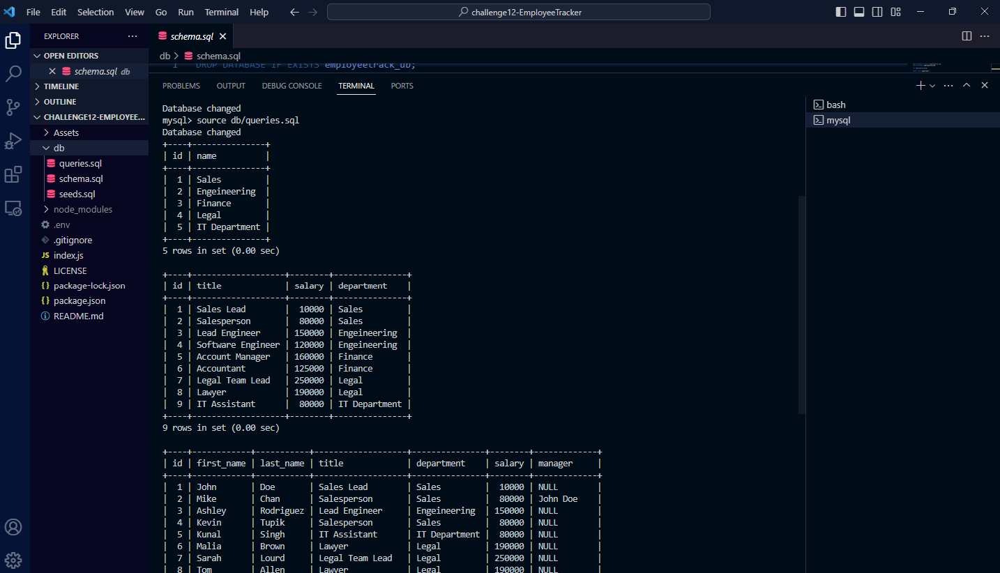

# challenge12-EmployeeTracker

## Description
In this challenge i will be demonstrating how to use schema,seeds,and queries to populate a series of questions using the command line node index.js. I will create a code to show an array of questions each leading to a detailed and organized chart of our employees, department, and roles with the option to add and view roles/departments.

## Installation
<ol>
    <li>Create Repository on Github</li>
    <li>Clone Repository to Computer and open in VS Code</li>
    <li>Install Node Modules</li>
    <li>Create schema, queries, and seeds sql</li>
    <li>Create database/tables/values/li>
    <li>Create functions in Index.js to populate questions and connect to database when user runs node index.js</li>
    <li>Test database and make sure results populate with functions</li>
    <li>Create README</li>
    <li>Deploy link via github and submit in bootcamp with video link</li>
</ol>

## Usage

Link to github: <a href="https://github.com/bizwliz/challenge12-EmployeeTracker">Challenge 12 Employee Tracker</a>

Video Demonstration: 

## License
 

## Tests
Tested using VS Code.